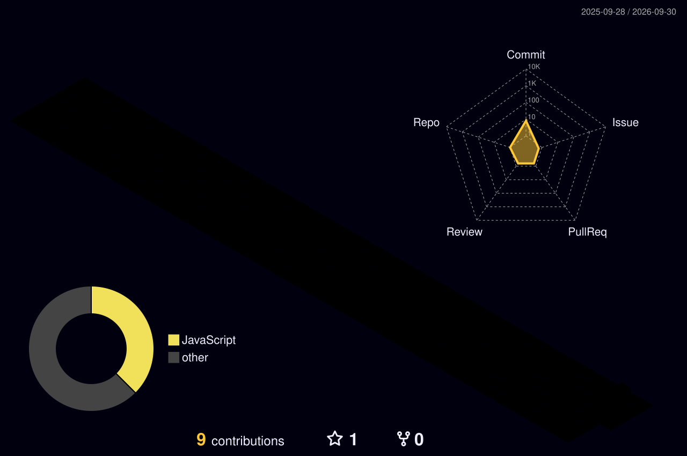
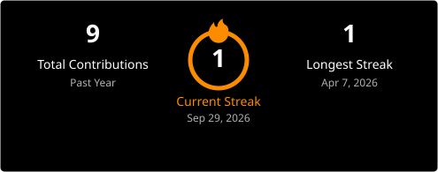

<div align="center">

<a href="https://github.com/Piyushsharma9878">

</a>

<br>

<p>
<a href="https://github.com/Piyushsharma9878">

</a>
<a href="mailto:sh23piyush@gmail.com">

</a>
<a href="https://github.com/Piyushsharma9878/NoteNetra">

</a>
<a href="https://github.com/Piyushsharma9878/restro">

</a>
</p>

<br>


</div>

<br>

---

## About Me

I'm **Piyush Sharma**, a passionate **Software Engineer** and **Systems Builder** focused on building reliable, high-impact software at the intersection of **Full-Stack Engineering, IoT Systems, and Applied AI/ML**.

I build systems at the intersection of **clean backend architectures, modern interactive web applications, and connected hardware devices**.

Currently working on:

* 📦 **NoteNetra**: IoT-enabled transaction tracking and alternative cashflow credit scoring platform for offline MSMEs
* 🍽️ **Restro**: Modern restaurant management and ordering web application built with React and Vite
* 🧠 **Applied AI & Automation**: Machine learning pipelines, anomaly detection, and autonomous workflows
* ⚙️ **Full-Stack Systems**: Responsive frontends coupled with performant backend services
* 🔬 **Hardware & Embedded IoT**: ESP32 microcontrollers, embedded C/C++, sensor integration, and telemetry

> **I don't just experiment with code — I build systems that solve real-world problems.**

---

## 🚀 Currently Building

```text
┌─────────────────────────────────────────────────────────────────┐
│                         CURRENT FOCUS                           │
├─────────────────────────────────────────────────────────────────┤
│                                                                 │
│  Full-Stack         →  React · Vite · TypeScript · Node.js      │
│  Hardware & IoT     →  ESP32 · Embedded C/C++ · Sensor Telemetry│
│  Backend Systems    →  FastAPI · Python · REST APIs · DB        │
│  AI / ML Systems    →  NLP · Anomaly Detection · AI Tooling     │
│  Systems & DevOps   →  Linux · Docker · Git · CI/CD             │
│                                                                 │
└─────────────────────────────────────────────────────────────────┘
```

### Core Focus Areas

* **IoT & Embedded Systems**: Building end-to-end connected systems combining ESP32 microcontrollers, edge sensors, and cloud communication protocols.
* **Modern Web Development**: Crafting performant, responsive web apps utilizing React, Vite, modern JavaScript/TypeScript, and scalable CSS.
* **Intelligent Data & AI**: Leveraging machine learning and natural language processing to extract insights from real-world data streams.

---

# 🏆 Recognition

<div align="center">

| Achievement                                |         Result         |
| :----------------------------------------- | :--------------------: |
| 🚀 **Samsung Solve for Tomorrow 2025**     | Top 10 / 20,000+ teams |
| 🥇 **Supernova Hackathon — GL Bajaj 2025** |        1st Place       |
| 🇮🇳 **National-Level Competitions**        | Finalist / Innovator   |

</div>

---

# 🧩 Featured Projects

<table>
<tr>

<td width="50%" valign="top">

## 📒 NoteNetra

### Smart IIoT-Powered MSME Cashflow Platform

**Top 10 — Samsung Solve for Tomorrow 2025**

An affordable IIoT + Web platform that transforms India's offline cash-based shops into digitally visible, creditworthy businesses:

* ESP32 hardware device tracking cash & transaction events
* Web dashboard generating instant business analytics
* Alternative credit score engine enabling loans without GST or CIBIL
* Storefront builder & growth hub for shopkeepers

**Impact**

`1,000+` daily transactions targeted  
Empowering underserved MSMEs with credit access

**Stack**

`ESP32` `C++` `Python` `IoT` `HTML/CSS`

[Repository →](https://github.com/Piyushsharma9878/NoteNetra)

</td>

<td width="50%" valign="top">

## 🍽️ Restro

### Modern Restaurant Management & Ordering App

A fast, responsive web application designed for streamlined restaurant operations and dining experiences:

* Dynamic interactive menu catalog
* Real-time cart and order state management
* Modular component architecture with Vite HMR
* Optimized mobile-first UI/UX design

**Impact**

Instant UI response with ultra-fast Vite build  
Seamless customer ordering workflow

**Stack**

`React` `Vite` `JavaScript` `HTML5` `CSS3`

[Repository →](https://github.com/Piyushsharma9878/restro)

</td>

</tr>

<tr>

<td width="50%" valign="top">

## 🔐 AIRAVAT XDR

### Autonomous AI Cyber Defense Platform

Real-time cyber-defense platform combining machine learning and threat classification:

* Isolation Forest anomaly detection
* NLP phishing classification
* Risk-score fusion algorithms
* FastAPI backend with React management dashboard

**Impact**

`<2s` response latency  
`<5%` reported false-positive rate

**Stack**

`Python` `FastAPI` `React` `Scikit-learn` `NLP`

</td>

<td width="50%" valign="top">

## 🎙️ Voice-Based AI Caller

### Autonomous Business Calling Agent

An intelligent voice-based AI agent built specifically for business communications:

* Natural conversational flow and dynamic context switching
* Low-latency voice processing and synthesis
* Business logic integration for automated customer qualification
* Seamless backend integration

**Stack**

`Python` `LLMs` `Speech-to-Text` `Text-to-Speech` `FastAPI`

</td>

</tr>
</table>

---

# 🧠 Engineering Interests

I'm particularly interested in the layer **between user-facing applications and physical systems**.

```text
                    ┌──────────────────────┐
                    │       USER / API     │
                    └──────────┬───────────┘
                               │
                               ▼
                    ┌──────────────────────┐
                    │    APPLICATION       │
                    │                      │
                    │  React · Web · APIs  │
                    └──────────┬───────────┘
                               │
                               ▼
                    ┌──────────────────────┐
                    │    SYSTEMS LAYER     │
                    │                      │
                    │ APIs · Workers · DB  │
                    │ Docker · Linux · CI  │
                    └──────────┬───────────┘
                               │
                               ▼
                    ┌──────────────────────┐
                    │      REAL WORLD      │
                    │                      │
                    │ Users · Devices      │
                    │ Sensors · Hardware   │
                    └──────────────────────┘
```

### Areas I'm actively exploring

* IoT architecture & edge devices (ESP32)
* Full-stack web application development (React / Vite)
* Machine learning & anomaly detection
* Autonomous AI agents & intelligent tooling
* High-performance REST APIs & microservices
* Linux systems & containerized deployments
* Developer tooling & open-source software

---

# 🛠️ Tech Stack

### Languages

<p>


</p>

### Frameworks & Libraries

<p>


</p>

### Hardware / IoT

<p>


</p>

### Infrastructure & Tools

<p>


</p>

---

# 📊 GitHub Activity

<div align="center">



<br><br>

### 🔥 Contribution Streak



<br><br>

<b>Building consistently. Learning continuously. Shipping deliberately.</b>

</div>

---

# 📈 Contribution Journey

```text
2024
 │
 ├── Started programming journey
 ├── Core computer science fundamentals
 └── Building first web & software projects
        │
        ▼
2025
 │
 ├── NoteNetra — IIoT MSME credit platform
 ├── Top 10 — Samsung Solve for Tomorrow 2025
 ├── 1st Place — Supernova Hackathon (GL Bajaj)
 └── Embedded IoT & full-stack applications
        │
        ▼
2026
 │
 ├── Advanced full-stack systems (React, Vite, Node.js)
 ├── AI/ML & intelligent workflow automation
 ├── Scalable REST APIs & production architectures
 └── Open source contributions & systems engineering
        │
        ▼
     NEXT →
     Scalable Distributed Systems
     Production AI Products
     Open Source Leadership
```

---

# 🎯 2026 Goals

```text
[✓] Top 10 — Samsung Solve for Tomorrow 2025
[✓] Deploy IIoT + Web hardware solution (NoteNetra)
[✓] Build modern React + Vite applications (Restro)
[✓] Win national-level hackathons

[ ] Deepen systems & distributed engineering
[ ] Contribute meaningfully to open source
[ ] Expand AI agent and IoT architectures
[ ] Scale products from 0 → 1
```

---

<div align="center">

## Let's build something meaningful.

**Software Engineering · Full-Stack Development · IoT Systems**

<br>

<a href="https://github.com/Piyushsharma9878">

</a>

<a href="mailto:sh23piyush@gmail.com">

</a>

<br><br>

<sub>Full-stack systems • IoT & hardware • software engineering</sub>
<br><br>

<i>"Don't just learn — build something real."</i>

<br><br>


</div>
